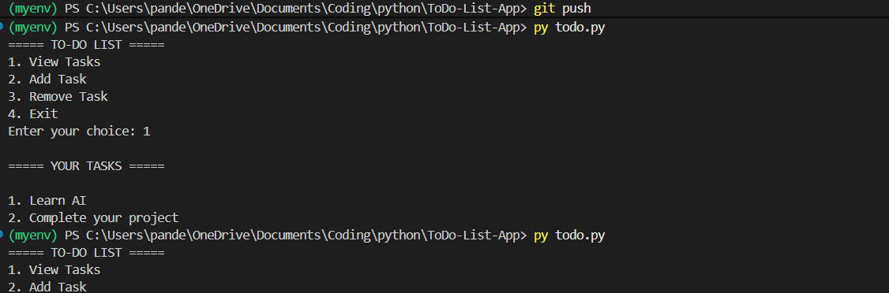
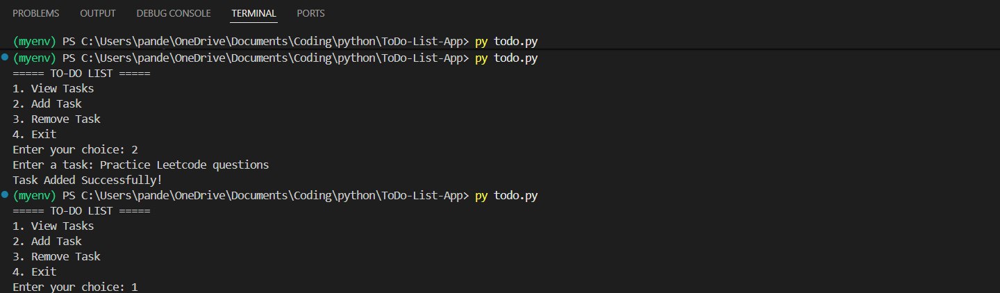
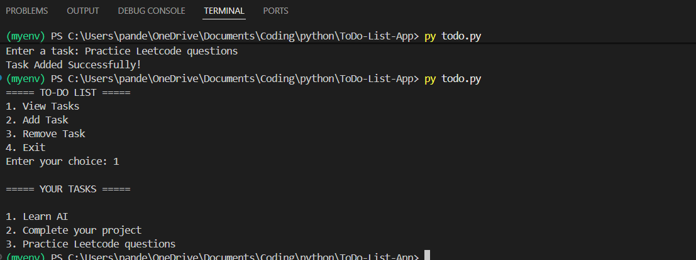

# 📝 To-Do List App
This project was built to practice Python fundamentals including file handling, loops, conditional statements, and basic CRUD operations.
A simple command-line To-Do List application built using Python.

## Features

- View Tasks
- Add Tasks
- Remove Tasks
- Stores tasks permanently using a text file
- Input validation for invalid task numbers

## Technologies Used

- Python
- File Handling

## Screenshots

### Main Menu


### Adding a Task


### Viewing Tasks


## How to Run

1. Clone the repository

```bash
git clone https://github.com/kritikapandey09/ToDo-List-App.git
```

2. Open the project folder

3. Run

```bash
py todo.py
```

## Project Structure

```
ToDo-List-App
│── todo.py
│── tasks.txt
│── README.md
```

## Author

Kritika Pandey
